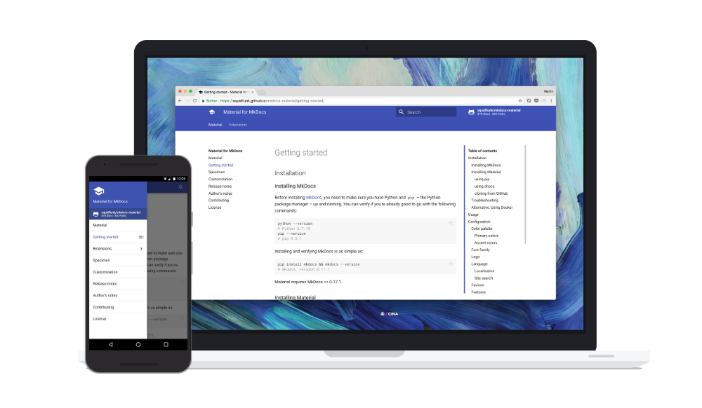

# How to setup mkdocs-material
 
## Image sample from /docs/_images
```md

```


## Environment setup
* Install Python
* reference: https://squidfunk.github.io/mkdocs-material/getting-started/
```bash
# check if pip is installed
$ pip --version

# intall mkdocs
$ pip install mkdocs

# check if mkdocs version is higher than 1.0.0
$ mkdocs --versioin 

# install mkdocs-material
$ pip install mkdocs-material

# clone starter - already linked in aws-amplify console
$ get clone  https://github.com/kebinlee1/anchor-docs.git <dir_name> # id, pw required
$ cd <dir_name>

# run in local pc for editing live viewing in browser
$ mkdocs serve 
## open localhost:8000 end edit dpcs/sample/sample.md

```